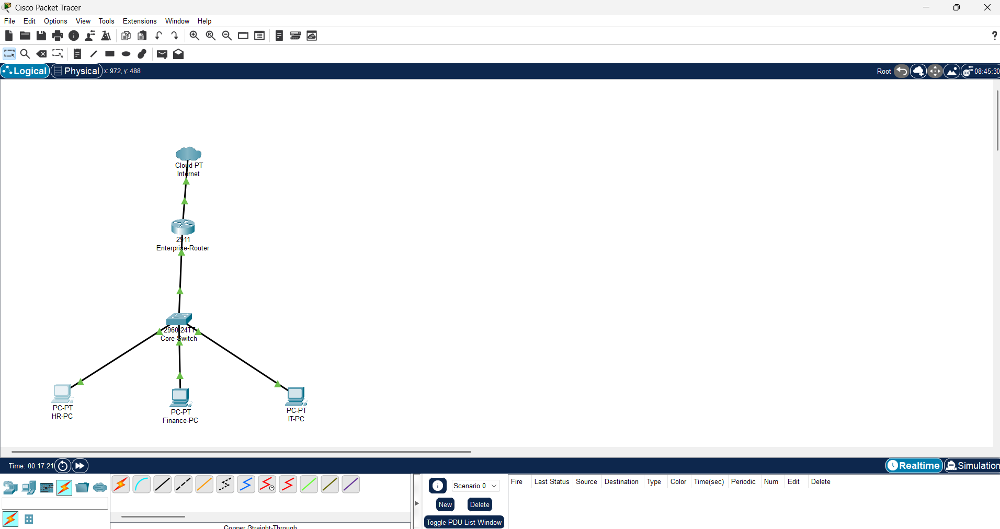

# Enterprise Network Design

## Project Overview

This project demonstrates the design and implementation of an enterprise-style network using Cisco Packet Tracer. The network was built for a fictional company, **TechSolutions Pty Ltd**, to simulate a real-world business environment.

The project includes VLAN segmentation, inter-VLAN routing, DHCP, NAT/PAT, and connectivity verification.

---

## Technologies Used

- Cisco Packet Tracer
- Cisco IOS
- VLANs
- Router-on-a-Stick
- DHCP
- NAT/PAT
- TCP/IP
- Switching
- Routing

---

## Network Topology



---

## VLAN Design

| VLAN | Department | Network |
|------|------------|----------------|
| 10 | HR | 192.168.10.0/24 |
| 20 | Finance | 192.168.20.0/24 |
| 30 | IT | 192.168.30.0/24 |

---

## Features Implemented

- VLAN Creation
- Switchport Configuration
- Trunk Configuration
- Router-on-a-Stick
- DHCP Pools
- NAT/PAT
- Inter-VLAN Routing
- Connectivity Testing

---

## Verification

The network was verified using:

- show vlan brief
- show interfaces trunk
- show ip interface brief
- show ip dhcp binding
- show ip dhcp pool
- show ip nat translations
- Ping tests between VLANs

---

## Repository Structure

```
Enterprise-Network-Design
│
├── Images
├── Reports
├── Configurations
├── Commands
└── Topology
```

---

## Skills Demonstrated

- Enterprise Network Design
- VLAN Configuration
- Inter-VLAN Routing
- DHCP Configuration
- NAT/PAT
- Cisco IOS
- Network Troubleshooting
- Documentation

---


## Author

Parneet Kaur

Bachelor of Information and Communication Technology (Cyber Security)

Western Sydney University

